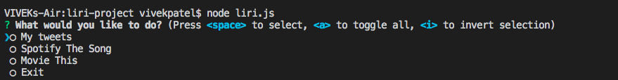

# LIRI : node.js App
LIRI is like iPhone's SIRI. LIRI is a command line node app that takes in parameters and gives you back data.

## Installiation:
The package.json lists all of the dependent node packages.

please run  'npm install'.

### Usage Example:

#### See Tweets:
This will show your last 7 tweets and when they were created at in your terminal/bash window.

#### Spotify This Song:
This will show the  information about the song in your terminal/bash window

#### Movie This:
This will show the Movie searched information to your terminal/bash window:

